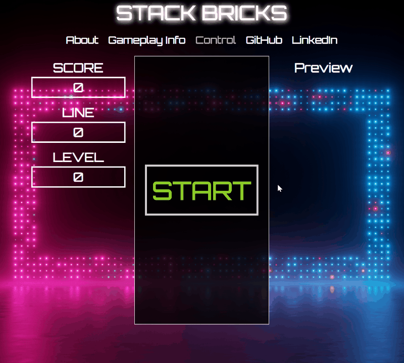

# Stack Bricks

## About

Stack Bricks is a JavaScript game inspired by the classic game Tetris.

[Play Here](https://tokyoanime.github.io/stack_bricks/)



## How to play

+ Goal: Score as many points as possible by clearing horizontal lines of bricks
+ Clear Line: To clear a line, fill every square within a single row
+ Score Points: Earn points by clearing lines. Clearing multiple lines at once will earn bonus points
+ Game Over: Game is over once bricks are stacked to the very top

## Control Keys


## Game Logic

```js
gameLoop(timestamp = 0) {
  this.displayLineCount();

  let deltatime = timestamp - this.lastTime;
  this.lastTime = timestamp;
  let rows = 0;
  this.dropCounter += deltatime;
  if (this.dropCounter > this.dropInterval) {
    Control.softDrop(this.currentBrick);
    if (collission(this.game.playArea, this.currentBrick)) {
      this.currentBrick.pos.y--;
      this.updateGameState();
      this.gameReset();
      rows = this.game.clearLine();
      this.updateScore(rows);
      this.updateLineCount(rows);
      this.updateLevel();
    }
    this.dropCounter = 0;
  };

  this.render();
  const requestAnimation = requestAnimationFrame(this.gameLoop.bind(this));
  if (this.isPaused || this.gameOver) {
    this.ctx.clearRect(0, 0, this.canvas.width, this.canvas.height);
    cancelAnimationFrame(requestAnimation);
  }
};
```

```js
const collission = (playArea, currentBrick) => {
  const brick = currentBrick.brick;
  
  for (let y = 0; y < brick.length; ++y) {
    for (let x = 0; x < brick[y].length; ++x) {
      if (brick[y][x] !== 0 &&
        (playArea[y + currentBrick.pos.y] &&
          playArea[y + currentBrick.pos.y][x + currentBrick.pos.x]) !== 0) {
        return true;
      }
    }
  }
  return false;
}
```

```js
gameReset() {
  this.currentBrick = this.previewBricks.shift();
  this.previewBricks.push(new Brick(this.game.playArea));
  renderPreview(this.previewBricks);
  
  if (collission(this.game.playArea, this.currentBrick)) {
    this.game.playArea.forEach(row => row.fill(0));
    this.previewBricks = [];
    this.gameOver = true;

    this.highScores.push(this.score);

    const compareScore = (a, b) => { return a - b};
    const topScores = this.highScores.sort(compareScore).reverse().slice(0,5);

    localStorage.setItem('tetris-high-score', JSON.stringify(topScores));

    let htmlScores = '';
    let scoreList = document.getElementById('high-score-list');
    scoreList.innerHTML = '';
    topScores.forEach(score => {
      htmlScores = htmlScores + `<li>${score}</li>`;
    });
    scoreList.innerHTML = htmlScores;

    document.getElementById('game-over-container').style.display = 'flex';
  };
};
```
Above three functions are the core functions that help loop the game. The gameLoop function will keep rendering the bricks until paused or game over. Game is over if the new brick detect collission as soon as it render in the playArea.


## To-dos/future features

+ Add game music
+ Enable player to hold brick
+ Enable hard drop
+ Animate clearing of line
+ Show ghost piece
+ Keep high score in backend server instead of local storage
+ Game room server to allow for multiplayer