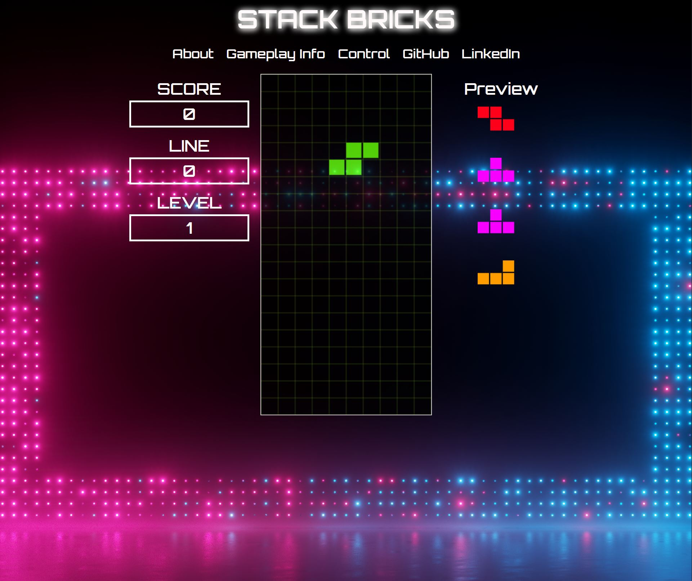

# Stack Bricks

## About

Stack Bricks is a JavaScript game inspired from the classic game Tetris.

[Play Here](https://tokyoanime.github.io/stack_bricks/)

## How to play

+ Goal: Score as many points as possible by clearing horizontal lines of bricks
+ Clear Line: To clear a line, fill every square within a single row
+ Score Points: Earn points by clearing lines. Clearing multiple lines at once will earn bonus points
+ Game Over: Game is over once bricks are stacked to the very top

## Control Keys

## To-dos/future features

+ Enable player to hold brick
+ Start/end game screen